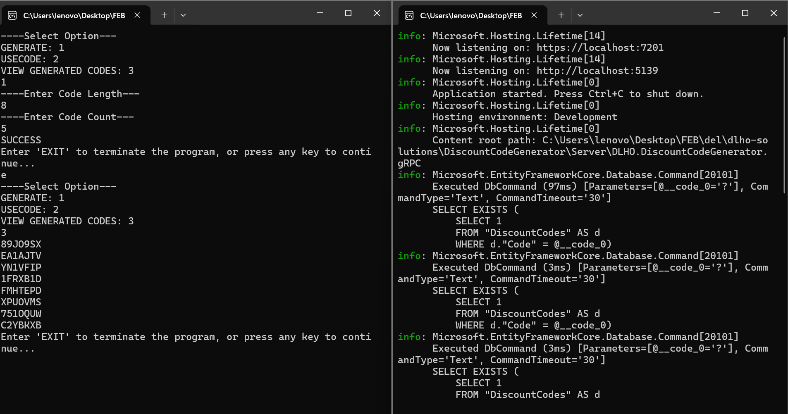
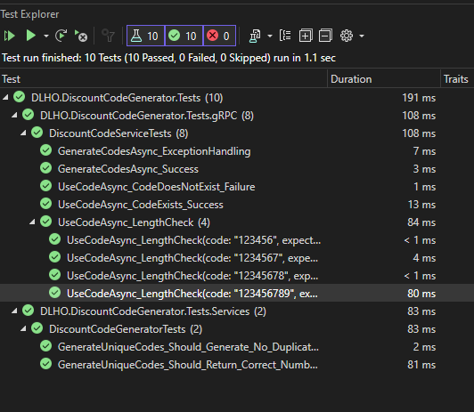

# Discount Code system

This application is a Discount Code System implemented using gRPC (Google Remote Procedure Call) in .NET. It allows generating and using discount codes through a server-side application.

- 
- 

## Features

- **Discount Code Generation**: The system can generate unique discount codes of length 7-8 characters.
- **Discount Code Usage**: Clients can use generated discount codes.
- **Real-time Communication**: Clients can communicate with the server in real-time using the gRPC protocol.
- **Persistence**: Generated discount codes persist even if the server is restarted.
- **Scalability**: The system is capable of processing multiple requests in parallel.

## Requirements

- .NET Core SDK
- Docker or a locally running PostgreSQL installation
- Code Editor (Visual Studio is recommended)

## Technologies Used

- **.NET and gRPC:** A high-performing and open-source version of RPC framework
- **Entity Framework Core:** ORM for interacting with the database.
- **xUnit and Moq:** Testing frameworks for unit testing.
- **.NET Console Application:** Client side implementation.
- **PostgresSQL:** Relational database management system for storing discount codes
- **Docker:** For containerizing our database

## Getting started

- Unzip the project:
- Navigate to the project directory
- If you don't have a local PostgreSQL installation, start one in docker: `docker-compose up -d` using the docker compose file provided
- Adjust the `.env` and `appsettings.json` with your PostgreSQL credentials (they already match the ones from the docker command above).
- - Update the database with migrations: `dotnet ef database update`
- Start the app ([both backend and frontend at once](https://learn.microsoft.com/en-us/visualstudio/ide/how-to-set-multiple-startup-projects?view=vs-2022)): `<Multiple Startup Projects>` in visual studio
- Or follow the steps below to run the app
  - Navigate to the server-side project directory: `cd dlho-solutions/DiscountCodeGenerator/Server/DLHO.DiscountCodeGenerator.gRPC`
  - Run the server applications: `dotnet run`
  - Navigate to the client-side project directory: `cd dlho-solutions/DiscountCodeGenerator/Client/DLHO.DiscountCodeGenerator.App`
  - Run the client applications: `dotnet run`

## Usage

Run the client-side application and follow the instructions.

### Generating Discount Codes

To generate discount codes, clients can call the `GenerateCodesAsync` method exposed by the gRPC service. Clients need to specify the number of codes they want to generate.

### Using Discount Codes

Clients can use discount codes by calling the `UseCodeAsync` method exposed by the gRPC service. Clients need to provide the discount code they want to use.

### Fetch Discount Codes

Clients can use view generated codes by calling the `GetCodesAsync` method exposed by the gRPC service.

## App Implementation and Consideration

To complete this task, I used the gRPC protocol because of the following reasons:

- **Performance:** gRPC is a high-performance Remote Procedure Call (RPC) framework designed for low latency and efficient data transfer. This is ideal for the this scenario where we need to handle multiple requests in parallel for discount code generation and usage.
- **Strong Typing:** gRPC uses Protocol Buffers which define the data format for requests and responses. This ensures type safety and reduces the chance of errors during communication between server and client compared to raw TCP sockets. This aligns perfectly with the defined request and response formats in the document.
- **Scalability:** gRPC is designed for scalable microservices architecture. Since it's mentioned in the requirement that the server can be restarted without affecting generated codes, gRPC allows for easier integration with potential future scaling needs.
- **TCP Sockets:** While TCP offers low-level control and reliable communication, It require significant manual effort to manage data serialization and deserialization, making it less suitable for this structured communication.
- **WebSockets:** WebSockets are good for real-time bi-directional communication, but might be overkill for this system where communication is request-response based.
